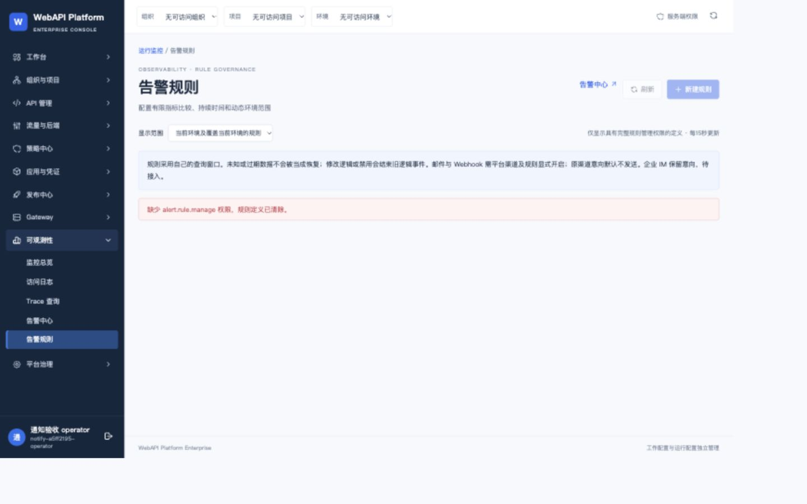

# 外部通知 N8 本机验收结果

2026-10-08。软件固定提交 `cf2b4708c94362faf6cb5f891a7364e0799eac5a`，实际镜像 `sha256:7913178628551b74657cdfe95627844a0c304bf41378b3db91f6234ef315570a`；文档提交与运行软件身份分别记录。

已通过全部 16 项实际协议/权限/竞态检查及全部 8 项必需 CUA 界面验收。另有同一显式 Email 测试任务从 Queued 到 Accepted 的回执截图，以及实际重试前后 API 预算核对和恢复后同 ID HTTPS/HMAC 重放结果。Accepted 表示服务接受，尚未验证真实用户收件。

冷备包含全部 11 卷，36 个内部 manifest 文件逐 SHA 回读。新 UUID 恢复保留原 DataProtection 钥匙、8 个通知私有文件和全部协议回执；源和恢复实例完整 Ready。额外 fixture 客户端重放返回202、duplicate=true、业务接受计数12→12，此项不是产品发送器或企业端点证明。

2026-10-08 用户明确回复“确认授权”后，仅将57531本批新建测试账号 `notify-a5ff2195-operator` 的Scope清空；账号及角色未删除，旧范围留存在私有运行目录。刷新会话后规则编辑器、全部定义和未保存邮件草稿立即清除。当前浏览器缩放1.1，物理覆盖1584×990对应实际DOM1440×900；原1309像素失败截图私有保留且不进入成功manifest。

最终证据门禁 passed=true，16/16实际、8/8必需界面、零缺项；全部逐文件摘要与固定内部镜像/源码身份一致，私有口令/HMAC/TLS私钥扫描无泄漏。独立通知及本机运行工具完整Node回归计数在本任务执行账本留存，不沿用旧验收数字。

通知模块 N1–N8 本机验收完成。原4192仍保持原安装，未合并/升级；后续D1数据保留恢复桥接、D2完整固定回归和唯一整分支审查、D3原实例交付分别执行。本结果不表示真实企业SMTP/Webhook、企业IM、生产安全或生产验收完成。

[完整证据](../evidence/notifications/cf2b470/verified/evidence.json)；[逐文件摘要](../evidence/notifications/cf2b470/verified/manifest.json)。原[未完成检查点](notification-approval-notification-checkpoint.md)按当时身份保留，本结果取代其当前验收状态。

