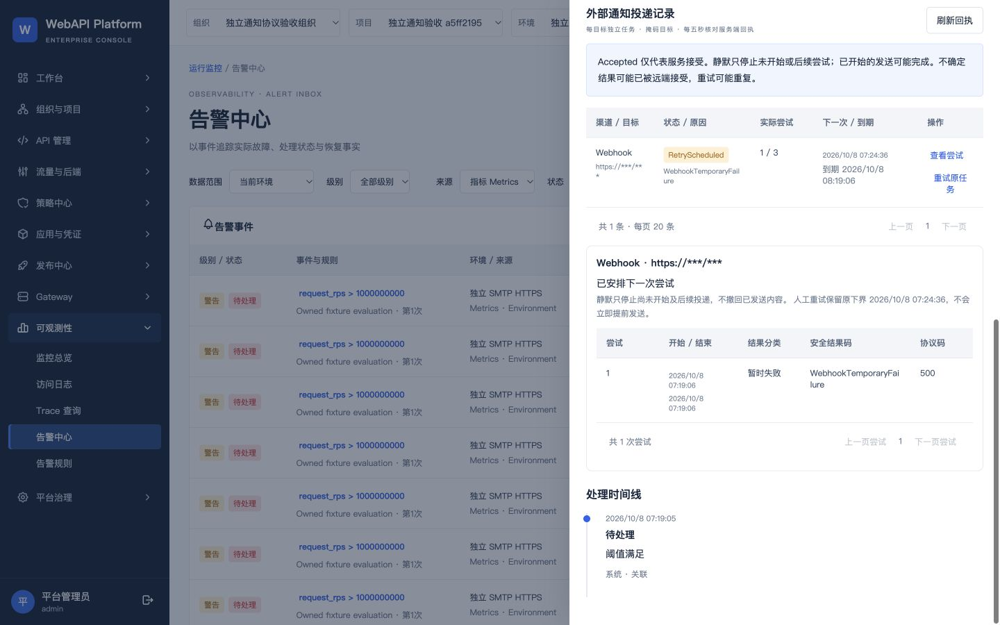

# 第三批通知验收检查点（尚未交付）

2026-10-08。运行软件 `cf2b4708c94362faf6cb5f891a7364e0799eac5a`，镜像 `sha256:7913178628551b74657cdfe95627844a0c304bf41378b3db91f6234ef315570a`。本文件的文档提交不是运行软件身份。

- 实际通知协议/权限/竞态检查：16/16 通过，独立 UUID 克隆 57531；输入为明确的演示指标评估，后续由实际平台、数据库、双 Worker 和协议接收器执行。
- 必需界面检查：7/8 完成；1440 设置、测试入队、尝试记录、原预算重试、键盘焦点和告警链接；1280 规则编辑。另有同一 Email 测试任务 Accepted 回执截图。Accepted 表示 SMTP/HTTPS 服务接受，不等于用户收件确认。
- 原预算人工重试：同一任务修订 3→4，1/3 次数、下次下界和到期时间均不变，接收器调用数仍为 1。Worker 暂停期间状态保持 RetryScheduled，没有提前发送。
- 冷备与独立新 UUID 恢复：11 卷、36 个 manifest 文件逐 SHA 回读通过；DataProtection 钥匙及 8 个通知私有文件不变；协议回执完整，源及恢复实例均 Ready。
- 恢复后额外 HTTPS/HMAC 重放：原 Accepted ID 返回 202、duplicate=true，业务接受计数 12→12。此补充使用 fixture 客户端重放，不能替代产品发送器或企业端点验收。
- 本次完整 Node 通知/运行工具回归：135 通过，0 失败、0 跳过。
- 原主目录 7 项改动、历史固定工具 216 个文件均逐 SHA 保持。原 4192 仍运行原 c1c2715 / bc07e5 镜像，5 个应用容器运行；本批未合并、未升级原实例。

最后一项 `revoked-clear` 尚未验收：自动审批两次拒绝清空本批新建测试账号 `notify-a5ff2195-operator` 的 Scope，虽已证明其归属独立 UUID 克隆且无邮箱，仍要求用户对具体账号、实例及撤权动作明确授权。账号及角色不删除，原范围可私有留存恢复；历史只读账号、原4192、SSO不受影响。异步授权问题已提出，未绕过拒绝。

因此本检查点 **complete=false，最终证据门禁未通过，N8 尚未完成**；D1 恢复桥接、D2 固定提交全回归及唯一整分支审查、D3 原实例合并/冷备/升级仍未执行。保留全部失败尝试及原始身份，不将缺项标成成功。

脱敏逐文件材料：[待完成证据](../evidence/notifications/cf2b470/pending/evidence-pending.json)；[检查点摘要](../evidence/notifications/cf2b470/pending/checkpoint-manifest.json)。公开材料不含私有口令、HMAC key、TLS私钥或原收件地址。

