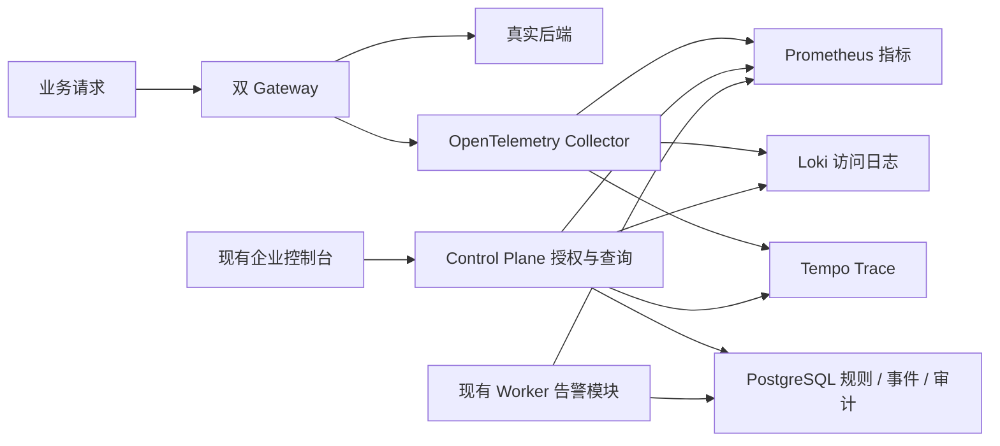

# WebAPI Enterprise V2 真实监控与告警设计

日期：2026-10-04。状态：用户已选择 A，并确认方案 1；用户在收到本文后回复“继续”，设计已确认，实施计划待审阅。本文是设计规格，不表示相关代码、服务或验收已经完成。

## 1. 目标、依据与已确认方向

将原第 28–33 页接入真实网关数据，形成“业务请求 → 指标 / 访问日志 / Trace → 规则判断 → 告警处理 → 审计”的闭环。保留原页面功能、字段、角色权限、组织 / 项目 / 环境架构及方案 1 的高密度企业 UI，桌面 1440px 优先。

设计依据：

- 原文档 `../WebAPI_Platform_Enterprise_V2_产品原型与数据架构设计.docx` 的可观测性架构、第 28–33 页、`alert_rules` / `alert_events` 表及权限规则。该相对路径相对于 enterprise 工程根目录；文档 SHA256 为 `643be90df86238c03711d21b48cc92442edbb979f428d3fa0827ef4c9e199fca`。
- 首期已验收工程基线 `81f7f495872602928872e5eda8d6cf4243493628`，现有 Cookie / CSRF、Scope、审计、幂等、ETag、双网关和不可变 Snapshot 协议。
- 用户本阶段选择：A 真实监控与告警；方案 1 本机隔离真实链路，沿用 OpenTelemetry → Collector → Prometheus / Loki / Tempo，随后可通过适配配置连接企业服务。

源文档作为业务与架构输入，不构成对外发送通知、读取企业凭证或修改现有企业监控环境的授权。本阶段先验证本机隔离环境；未提供的企业端点、TLS、存储容量和保留策略不作为已确认事实。

成功标准：真实成功、认证失败、后端失败、慢请求均有正确指标和脱敏日志；被采样请求可查 Trace；规则能按持续时间触发、确认、静默及恢复；跨 Scope 查询或处理失败；数据源故障不产生虚假恢复；首期发布、回滚、LKG 和单请求运行版本一致性继续成立。

## 2. 范围及实施分层

这是一个统一子系统：同一份运行数据契约服务 6 个页面，告警使用同一指标查询与 Scope 约束。分三个依赖阶段，随后统一验收；不是新增三个独立业务平台。

| 阶段 | 交付范围 | 验收重点 |
|---|---|---|
| O1 采集与指标 | 网关采集、Collector / Prometheus、查询适配、第 28 / 29 页 | 真实流量、单位与统计、运行版本、源故障 |
| O2 日志与 Trace | Loki / Tempo、脱敏与查询、第 30 / 31 页 | 关联查询、分页、采样、跨环境同 TraceId 隔离 |
| O3 告警治理 | 数据迁移、规则判断、第 32 / 33 页 | 持续窗口、重复执行、状态变化、撤权、审计 |

本阶段覆盖日志导出、Trace 瀑布图、规则测试、启停和全部四种源告警状态。规则通知字段保留；站内告警中心是本阶段有效处理渠道。Email / Webhook / 企业 IM 显示“待接入”，不得显示发送成功或执行外部投递。

不扩展复杂限流 / 熔断策略、SSO、系统设置页面、Kubernetes、跨地域 HA、任意 PromQL / LogQL / TraceQL 编辑器、全链路业务正文采集或企业生产容量验收。原总览中的 Circuit Open / Rate Limited 保留，现阶段标记“策略未启用”；不能用普通 429 或 503 推断平台已执行限流 / 熔断。

## 3. 组件与数据流

- Gateway：生成业务请求指标、专用结构化访问日志和 server / outbound client spans；不访问 PostgreSQL，不逐请求调用控制面，不等待监控写入。
- Collector：OTLP 接收，内存与队列限额、批处理、重试及属性白名单；指标通过其 Prometheus exporter 由 Prometheus 拉取，日志通过 Loki 原生 OTLP HTTP 接口，Trace 通过 OTLP 到 Tempo。
- Control Plane：对每个请求重新授权、解析允许的环境、构造受限查询、校验响应范围、投影安全 DTO。浏览器不持有外部数据源凭证，也不直接访问外部服务。
- Worker：复用现有进程，增加独立告警评估循环；发布、Outbox 与告警任务各自有取消、超时和错误隔离。平台自己的持续窗口及事件生命周期由 PostgreSQL 决定，不再另设一份 Prometheus Ruler / Alertmanager 规则事实。
- Infrastructure：新增 Prometheus、Loki、Tempo 的独立适配器以及规则 / 事件服务，不把三种源协议混入领域模型。Domain 定义指标口径、规则语法和状态机；Contracts 定义浏览器 DTO。

保留现有 Snapshot schema 和历史原字节。Gateway 使用部署配置中可信的 EnvironmentId；控制面根据该 ID 解析组织 / 项目，不相信浏览器或业务客户端提供的 Scope 标签。采集上下文从实际租用的 generation 取得 API / Route / Cluster / version / sequence，最终目标从实际选中的 Destination 取得。

Source Cluster ID 和 runtime Cluster ID 分别保存，避免共享后端历史副本或派生运行 ID 被误当成新管理资源。环境归属由数据库确定；已停用资源按现有授权返回明确状态，不绕过 Scope。

## 4. 网关采集与首期兼容性

### 4.1 采集位置及请求分类

在请求进入业务管道时记录单调时钟开始时间；在认证及路由 generation 被确定后附加实际上下文；请求最终完成、超时、取消或异常时仅记录一次。不得延长 AdmissionGate 持有期，不得在 `finally` 移除 generation 后重新读取 Current 代替旧请求上下文。

- 已匹配请求：记录环境、API、Route、运行 Cluster、管理 Cluster、可识别的有效应用、Destination、HTTP method / status、duration、固定 outcome code。
- 401 无效凭证：API 可知，应用为 Unknown；不使用未验证 accessKey 把请求归入某应用。
- 403 有效凭证但 API 未授权：应用可知，仍记录失败；不记录凭证本身。
- 匿名路由：应用为 Anonymous。未选择后端的失败请求 Destination 为 None。
- 未匹配 404 和无 LKG 的 503：进入环境级业务总量，API 为 Unmatched；不伪归属目录中的某 API。
- 精确 `/health/live`、`/health/ready`、主动健康探测和内部节点管理请求不进入业务 RPS。其他 `/health` 前缀仍遵循现有业务规则。
- 客户端中途断开：保留真实结果分类；未发出 HTTP status 时以 outcome=ClientAborted 展示，不能伪造已经发送的 499。代理失败的真实 502 / 504 与后端返回 5xx 分开标注。

采集输出采用有界队列和异步批处理；队列满或源故障时丢弃遥测并增加诊断计数，不阻断业务响应。采集异常不得改变正常状态码、抛出代理错误或影响切换 / ACK / LKG。队列溢出时 UI 显示已知采集缺口；数据源可用不能被解释为数据完整。

### 4.2 关联 ID 与敏感字段

Trace 查询主键采用 W3C Activity TraceId。既有 `X-WebApi-Trace-Id` 与认证错误 `traceId` 保留原 request identifier 语义，新增日志 `requestId` / `traceId` 两列并在错误响应补充 `w3cTraceId`；原客户端读取旧字段不受影响。上下游 Trace 使用标准 traceparent，不能把既有非 W3C ID 当成 Tempo ID。

所有采集字段采用白名单：禁止 API Key、Secret / hash、Authorization、Cookie、数据库连接、URL query、请求或响应正文、任意异常原文及包含用户值的完整 URL。Method / Path 保留为 method 与路由模板；未匹配路径用固定占位。Span 属性及 OpenTelemetry 自动插桩也必须应用同一脱敏规则，不能仅脱敏 UI。

IP 从实际连接地址取得；仅在显式可信代理配置存在时使用转发头。日志保存掩码后的地址和使用部署 Secret 计算的 IP HMAC，可由服务端将精确 IP 筛选输入转换为 HMAC 查询；浏览器显示和 CSV 导出均为掩码，原 IP 不保存到遥测。HMAC 密钥由 SecretFile 注入，不进入文档、源码或 UI；轮换会改变精确查询覆盖期，接口返回相应覆盖提示。

客户端传入的 traceparent 可能使不同 Scope 共享 TraceId，不能充当权限证明。跨环境 Trace 仅投影当前授权环境的 spans；无可信环境属性的 span 不输出，返回 `partialTrace=true`。本阶段保证网关 server → 代理 client 的瀑布图；未插桩的企业后端内部调用不能凭空展示。

### 4.3 维度、采样与新鲜度

指标拆成用途明确的计数器、时延 histogram 和健康 gauges；用环境 / API / 应用 / HTTP状态 / Destination 的必要组合完成源页面聚合，避免把所有维度同时塞入所有 histogram。禁止以 TraceId、requestId、原始路径、IP、凭证、异常文本、configVersion / sequence 创建时间序列标签；版本信息只进入日志 / Trace。

API / App / Destination 标签使用已验证资源 UUID，匿名、无效认证、未匹配均用固定值。Loki 索引标签仅保留 service 与环境等低基数字段，TraceId、应用、节点实例及运行版本作为结构化 metadata。新加维度前应记录时间序列成本；本阶段不提供用户自定义任意标签。

指标和日志不按 Trace 采样率缩减；Trace 支持显式部署采样配置。本机验收配置 100% 采样，企业推荐值由部署验收决定。接口返回当前配置及“未命中可能由于采样或保留期”，不承诺每条日志均有 Trace。

Gateway 每 15 秒导出可信环境 / 节点的遥测观测时间 gauge。控制面将其与数据库启用节点集合比对，在对应查询评估时点已超过45秒未观测则视为过期；告警延迟查询的30秒不重复算作采集过期。浏览器另外显示距当前时间的真实数据年龄。不能只用 Collector 存活证明业务采集正常。某节点缺数据时，聚合标为 Partial，返回缺失节点；告警相关聚合为 Unknown，避免单节点缺失使错误率虚降。禁用节点不再属于预期采集集合。

## 5. 指标口径与查询契约

### 5.1 统一口径

| 字段 | 口径 |
|---|---|
| RPS | 所选窗口内已完成业务请求数 / 窗口秒数；趋势点用对应 bucket 内增量 / bucket 秒数 |
| 成功率 | 正常完成且对外 HTTP 2xx + 3xx / 全部完成请求；认证失败、代理错误、取消均进入分母，断开请求即便已发送200头也不计成功 |
| 4xx / 5xx | 对外实际 HTTP状态对应的请求数及占比；另列无状态取消数 |
| P50 / P95 / P99 | 合并 histogram buckets 后计算分位数，单位 ms；禁止平均各节点 P95 |
| Top APIs / Apps | 同一窗口请求量排序，稳定次序、可分页；Unknown / Anonymous 独立列示 |
| Slow APIs | 同一窗口 P95 排序，同时显示样本量；零样本不参与 |
| Unhealthy Destinations | YARP 当前可验证健康状态按节点 / 运行目标记录；Unknown / Disabled 不当成 Healthy |

时延包含认证及代理完成耗时，与端到端网关耗时一致。有效源但无请求时请求数和 RPS 可为 0，成功率、比例和分位数为 null；缺源或过期时所有相关 KPI 为 null 并带状态，不能用 0 填补。不存在已启用采集节点时是NoData，不能由空集合推出完整覆盖。

默认最近 1h，提供 1h / 6h / 24h / 7d，统一 UTC 查询，浏览器按本地时区展示。时间边界为 `[start,end)`，最大跨度 7d；趋势最多 600 点，step 由服务端计算。当前刷新会固定同一 end，使 KPI、趋势和 Top 口径一致。计数器增量应先处理单序列 reset 再聚合；不同节点版本切换和重启不能造成负请求量。

规则使用滚动窗口，与页面全选时间 KPI 分开标注。Prometheus的increase / rate按采样外推，窗口请求数显示为近似量；不把时间窗口查询当成逐请求计费账本。验收对采集计数器前后差给确定预期，对窗口增量 / 比例记录采样误差界限。histogram 分位数属于估计值，显示精度受 bucket 边界影响，按对应 bucket 范围验证，不把显示小数误认为实际毫秒精度。

### 5.2 服务端 Scope 和查询约束

每次查询需一个实际 EnvironmentId；总览也支持单项目下“全部可访问环境”，由服务端枚举、逐环境授权后合并。不得跨组织合并；环境级用户不能因为项目选择器显示项目名而获得整个项目数据。

查询参数仅允许结构化资源 ID、时间、状态、时延、分页及纯文本 Keyword；不接收外部 URL、数据源 tenant header 或原生查询语言。服务端生成强制环境条件和允许的 API / App / Destination 条件，输入必须为同 Scope 的实际资源或受控系统占位。

`metrics.read`、`log.read`、`trace.read` 相互独立。API详情跳日志和 Trace 时仍独立检查目标权限，拥有 metrics.read 不意味着可看日志。不允许的单条资源遵循现有 404；无功能权限 403；未登录 / 停用会话 401；停用 Scope 409。

数据源响应需二次校验环境标签 / 属性，返回安全 DTO 而非原始供应商对象。权限撤销后的下一请求立即失效；前端定期刷新请求遇到拒绝时清除图表、日志、Trace 详情和缓存，不继续显示旧 Scope 数据。请求取消 / Scope切换后，旧响应不得覆盖新环境。

所有查询响应包含 `start/end`、`sourceState`、`observedAt`、`coverage`、`sampling` 或适用的缺失原因。空数据 NoData、Partial、Unavailable、Stale、NotApplicable 分别呈现；整体源故障返回 503 `observability_source_unavailable`，保留安全的源类型和重试提示，不泄漏端点或凭证。查询超时默认 10 秒，响应大小上限 8 MiB；单次请求不自动无限重试。

## 6. 日志与 Trace 查询

访问日志保留源列 Time / TraceId / API / App / MethodPath / Status / Duration，增加 requestId、节点、运行 version / sequence、Destination 和 outcome 以解释运行事实。日志 ID 在采集时一次生成 UUID，重复投递按同 ID 去重。

日志查询支持环境、API、App、状态 / 状态段、时延上下限、精确 IP（HMAC）、脱敏字段 Keyword 和 TraceId；Keyword 为长度受限的文字匹配，不作为正则或 LogQL 执行。详情字段、跳 Trace、导出复用同一过滤与权限。列表默认 50 条、最大 100，按 Time + logId 稳定倒序，以固定查询截止时间和签名游标分页；同纳秒多条日志不能漏行。

由于 Loki 不提供页面编号，本页面采用“下一页 / 返回上一页”游标交互；不虚构总数。适配器必须处理边界时间同值以及供应商返回上限，若碰到无法完整翻页的源限制返回明确截断提示，不能静默漏行。

导出当前过滤条件的 CSV，上限 10,000 条并显式标记截断，验证权限贯穿读取过程；超时或撤权停止输出。禁止 CSV 公式执行（处理以 `= + - @` 开头的字段），导出仍脱敏，不临时生成公网链接。

Trace 查询支持 TraceId、API、时延和成功 / 错误 outcome，最大 7d、每页最多 100 条；采用固定范围与供应商可支持的时间游标，对结果去重，返回截止覆盖与 truncated。TraceId 格式验证不能替代 Scope 查询。

详情包含已授权 spans 的 parent / start / duration / kind / status / 安全标签，瀑布图按真实时间定位。只收到部分父节点时显示“部分链路”，不把跨度补造成完整调用。支持复制 TraceId、按相同环境和时间跳日志；单独 trace.read 不能顺便带出日志内容。日志无 Trace 结果时显示 NoTrace / 采样提示，查询源异常另行显示。

## 7. 六页面设计与交互

所有页面复用 Shell、设计 tokens、表格、筛选、反馈、抽屉和未保存离开保护；不重新选择视觉方向。页面可独立打开、刷新和浏览器前进 / 返回，过滤条件保留在 URL，敏感 IP 输入只保留当前内存，不进入 URL。

| 原页 / 路由 | 真实内容及关键操作 | 权限 |
|---|---|---|
| 28 `/observability/metrics` | 时间选择、RPS / 成功率 / P95 / P99 / 4xx / 5xx、P50等趋势、Top / Slow APIs、Top Apps、节点健康；按 API 下钻、按 App跳转其详情与日志 | metrics.read；目标页面单独授权 |
| 29 `/observability/apis/{apiId}` | API KPI、按 App / 状态 / Destination 分组、趋势；跳日志 / Trace，预填本 API 告警规则 | metrics.read；log.read / trace.read / alert.rule.manage 控制目标入口 |
| 30 `/observability/logs` | 完整源筛选、游标分页、详情抽屉、Trace跳转、当前查询导出 | log.read；Trace跳转需 trace.read |
| 31 `/observability/traces` | 条件查询、TraceId复制、列表、瀑布图、span详情与安全标签、日志跳转 | trace.read；日志跳转需 log.read |
| 32 `/observability/alerts` | severity / 环境 / source / status筛选，事件时间、资源、规则版本、数据新鲜度；确认、解决、静默、取消静默，关联指标 | alert.read；命令需 alert.operate，关联指标需 metrics.read |
| 33 `/observability/alert-rules` | 创建 / 编辑、范围、metric / expression / duration / severity / notification、启停、只读测试、最后评估状态；表达式报错及412保留编辑 | alert.rule.manage；测试也需当前目标Scope写授权 |

source 字段本阶段有效值为 Metrics，并显示实际来源 Prometheus；不伪造日志、外部平台或通知回执。App下钻保留筛选上下文；不新增原清单之外的独立“应用监控页”。

告警处理和禁用规则给出具体影响的确认面板；静默提供 15m / 1h / 4h / 24h 和必填原因。表单取消 / 侧栏跳转 / Scope切换 / Browser Back均复用首期输入保留机制。每页具备加载、无权限、无Scope、空数据、源异常、过期 / 部分数据、并发冲突、提交成功及失败状态。按钮通过权限呈现，服务端仍是最终判断。

## 8. 规则模型、表达式与范围

### 8.1 保留字段及补充

原 `alert_rules` 字段全部保留：id、organization_id、project_id、environment_id、name、metric、expression、severity、enabled、for_seconds。

明确补充字段：`revision`、`logic_revision`、`target_type`（Environment / Api / Destination）、`target_id` nullable UUID、`window_seconds`、`notification` JSONB、`created_by/at`、`updated_by/at`。revision用于全部编辑的并发检查，logic_revision仅在判断逻辑、Scope、目标、severity、持续窗口或enabled改变时递增。notification 本阶段保存站内中心以及未启用渠道的意向配置，不保存密钥或声称已投递。

原 nullable Scope 字段保持原意：环境非空必须属于项目且组织一致；项目非空 / 环境为空代表项目下所有 Active 环境；两者为空代表组织下所有 Active 项目 / 环境。宽范围规则要求该宽范围的写 Scope，不能用若干环境 grant 冒充组织 grant。指定 API 时 target 必须属于规则项目；组织级宽范围规则不指定单一 API / Destination。Destination 目标限定单环境。

规则对匹配的每个环境独立评估，事件锁定具体环境和目标资源。创建宽范围规则后新建 Active 环境自动纳入；该影响在保存预览明确显示。规则执行作为已授权的系统事实继续，创建者后来被停用或撤权不会自动删除规则；授权变更影响其后续编辑、查看及处理。Scope停用则暂停该 Scope 评估并标记原因。

规则 severity 枚举 Info / Warning / Critical，name最长128且范围内规范化唯一，for_seconds 0–86400，window_seconds 60–3600（健康 gauge 不使用滚动平均）。创建无规则默认启用；无内置自动规则向现有组织写入。

### 8.2 受限表达式

本阶段 expression 仍为 text 字段，但明确为受限语法：`<metric> <operator> <finite-number>`。operator 支持 `> >= < <= == !=`；metric 必须与 metric字段一致。禁止函数、逻辑组合、原生 selector、正则、子查询、外部 URL、任意标签和原生 PromQL。服务端解析语法树后根据可信 Scope 和目标构建 PromQL；不得字符串拼接原文转发。

| metric | 值 / 单位 | 示例 |
|---|---|---|
| request_rps | 窗口请求 / 秒 | `request_rps > 100` |
| error_5xx_ratio | 5xx / 全部请求，0–1 | `error_5xx_ratio > 0.05`，持续300秒 |
| latency_p95_ms | histogram估计分位数，ms | `latency_p95_ms > 1000`，持续600秒 |
| unhealthy_destinations | 目标中真实 Unhealthy 数 | `unhealthy_destinations > 0`，持续120秒 |

保留原示例三类规则。Circuit / RateLimit metric在策略接入前不可启用，返回不支持提示。跨Scope原生查询需求属于后续独立扩展，当前不宣称完整PromQL支持。

“测试规则”执行相同解析、Scope和只读实际查询，返回匹配资源、当前值、阈值、sourceState及是否满足条件；不跳过 for_seconds 立即写事件，也不发通知。无样本 / 源不可用 / 过期返回 Unknown，不能报告测试正常通过。编辑中的未保存规则可以测试，但测试不产生持久规则或事件。

## 9. 告警状态、评估与数据一致性

### 9.1 事件与评估记录

原 `alert_events` 字段全部保留：id、rule_id、resource_type、resource_id、status、severity、message、started_at、resolved_at、acked_by。

补充：组织 / 项目 / 环境归属、`rule_revision`、`logic_revision`、安全规则摘要、`resource_key`、`occurrence_no`、`revision`、`condition_started_at`、`acked_at`、`silenced_by/until/reason`、`resolved_by/reason`、`last_observed_at/value`、`last_condition`、`evaluation_state`。started_at为首次创建Open事件的时间，condition_started_at记录该次满足条件的Pending起点；后续确认 / 静默不改变这两个时间。事件创建时冻结severity和规则摘要；后续编辑规则不改写历史。message由固定模板生成，不包含外部原始异常或敏感查询。

新增 `alert_evaluation_states`：规则 / logic_revision / 环境 / resource_key唯一，保存 phase（Inactive / Pending / Firing / SuppressedUntilRecovery）、pending_since、last_evaluated_slot、last_success_at、last_condition、last_event_id、next_occurrence_no、evaluation_state、lease_owner/until/token及并发revision。租约token单调递增，防止过期实例提交迟到结果。新增 `alert_event_transitions` 追加事实保存 from/to、actor nullable、reason、occurred_at、命令关联ID。事件和状态事实不允许普通管理员删除。

事件 `(rule_id, logic_revision, environment_id, resource_key, occurrence_no)` 唯一；同规则 / 环境 / resource_key仅有一条非 Resolved 事件的部分唯一索引。事件资源ID保持nullable原字段，同时resource_key为稳定必填键，避免SQL NULL破坏去重。Scope外键与业务一致性约束一并迁移验证。

### 9.2 连续评估语义

Worker默认每15秒评估，查询时点延迟30秒以容纳采集；测试可显式缩短间隔，但证据必须记录真实配置。持续条件按成功观测连续性判定，不把进程睡眠、源断开或Worker停机时间计入 for_seconds。

1. 有效数据且条件首次满足：phase=Pending，保存pending_since。后续成功评估仍满足且间隔不超过两倍评估间隔，持续时间达到for_seconds时创建一条Open事件并进入Firing。for_seconds=0在首个有效满足观测触发。
2. Pending期间条件false、NoData、Unavailable、Stale、Partial、停用Scope或观测间隔超限：重置Pending计时，不能重启后用旧时间直接触发。
3. 已有Open / Ack / Silenced事件，条件仍true：更新安全观测事实，不创建新事件。查询失败或缺数据：保留业务状态，evaluation_state=Unknown；不自动Resolved。
4. 有新鲜且完整数据、条件false：自动Resolved，reason=Recovered。零流量使比例 / 分位数无定义时为Unknown，不是false。健康状态Unknown也不是恢复。
5. 人工Resolve必须填原因；若条件仍true或Unknown，评估phase=SuppressedUntilRecovery，避免每15秒新开同一告警。只有后续确认false才重新布防；再true且满足持续窗口创建新occurrence。
6. Worker重启保留事件，不重置Ack / 静默 / 人工抑制；Pending按最近成功观测间隔校验。禁止一次性追补历史槽位造成重复告警。

当规则被禁用或改变判断逻辑 / Scope / 目标，锁内将其已有非Resolved事件关闭，reason=RuleDisabled或RuleChanged，追加审计，再建立新的logic_revision评估状态。仅改name / notification不改变logic_revision且不重置Pending / Firing / SuppressedUntilRecovery；并发revision仍增加，后续评估需采用当前修订且历史事件冻结摘要保持不变。severity / for_seconds / window_seconds视为逻辑变更，重新计时；重新启用也从新的logic_revision开始。

已确认被移出规则范围或实际删除的资源以ResourceRetired结束事件；数据源不再返回某序列不能被当成资源删除。Active Scope停用只暂停，不伪称问题已恢复。

### 9.3 四种业务状态与命令

| 操作 | 合法状态 / 效果 |
|---|---|
| Ack | Open → Ack；记录acked_by/at。对Silenced可记录确认事实但维持Silenced；同人重复确认幂等，不覆盖首位确认人 |
| Silence | Open / Ack → Silenced；持续15分钟到24小时并填原因。再次静默可显式改变截止时间，需新revision |
| Unsilence或到期 | Silenced → Ack（已有确认）或Open（未确认）；若已发生确认恢复则Resolved，不能复活Resolved |
| Resolve | Open / Ack / Silenced → Resolved；人工原因必填，记录实际处理人；同时终止静默 |
| 自动恢复 | Open / Ack / Silenced → Resolved；system actor，reason=Recovered |

Resolved事件禁止重新打开原ID；再次故障创建新occurrence。静默按事件生效，不自动给整规则创建未来静默窗口；未来规则级维护窗口另行设计。本阶段无外部通知，但Silenced状态会阻止未来渠道投递接口采用该事件发送。

### 9.4 并发、事务与审计

用户命令沿用Cookie / CSRF、`If-Match`及`Idempotency-Key`。实际写事务内重新授权Scope与资源状态，412保留用户输入；同键同内容返回原结果，不同内容409。事件修改、transition、评估状态及audit_logs同事务提交。

Worker外部查询不持有治理锁；短事务认领规则 / 槽位租约，查询后短事务校验规则revision、enabled、实际Scope状态、当前租约token / 有效期和last_evaluated_slot，过时查询结果丢弃。数据库时间为租约权威，槽位只按递增时点提交，租约过期后新实例可接管；旧实例不能再落库。Worker并发实例用评估状态唯一键、行锁及槽位比较防重，不依赖单进程内存。Worker只处理规则定义范围，不能生成浏览器可用的通用授权身份。

状态变化的系统审计采用UserId=null、明确worker来源和关联ID；不冒用创建者身份。新增审计投影字段有白名单并脱敏；高频“条件仍true”的观测不逐次写治理审计，只更新评估事实。用户确认、静默、解决、规则创建 / 编辑 / 启停以及系统触发 / 恢复必须留审计。来源异常记录固定错误码与source类型。

## 10. 管理接口边界

接口前缀 `/api/v1`，下表为新增契约。读取按当前角色 ∩ Scope ∩ 资源状态判断；单条告警必须用其冻结实际环境授权，不能只按宽范围rule_id判断。

| 接口 | 权限 / 行为 |
|---|---|
| GET `/observability/metrics` | metrics.read；结构化范围、时间、KPI / 趋势 / Top分页 |
| GET `/observability/apis/{apiId}/metrics` | metrics.read；要求environmentId及资源一致性 |
| GET `/observability/logs`、`/logs/{logId}` | log.read；详情要求environmentId及受限时间定位 |
| GET `/observability/logs/export` | log.read；当前过滤CSV、行数限额和撤权终止 |
| GET `/observability/traces`、`/traces/{traceId}` | trace.read；当前环境查询、安全span投影 |
| GET `/observability/alerts`、`/alerts/{id}` | alert.read；仅授权范围、分页、transition详情 |
| POST `/observability/alerts/{id}/ack`、`/resolve`、`/silence`、`/unsilence` | alert.operate；ETag / 幂等 / 原因与时间校验 |
| GET `/observability/alert-rules`、`/alert-rules/{id}` | alert.rule.manage；完整规则Scope授权，列表不显示不可管理的宽范围规则 |
| POST `/observability/alert-rules` | alert.rule.manage；结构与范围验证、幂等 |
| PUT `/observability/alert-rules/{id}` | alert.rule.manage；ETag，保留全部源字段 |
| POST `/observability/alert-rules/{id}/enable`、`/disable` | alert.rule.manage；ETag / 幂等，展示影响 |
| POST `/observability/alert-rules/test` | alert.rule.manage；纯只读评估，不创建事件 |

规则列表和事件列表使用现有稳定分页约定，最大100条；列表包含可用操作和revision。POST只读测试仍验证CSRF，因为使用Cookie会话；它不要求幂等键。通用错误沿用Problem Details，422解析 / 字段错误，409状态 / 同键不同请求，412版本冲突，503外部源异常。浏览器不能任意设置事件status。

## 11. 部署、依赖与交付

新增独立Compose监控overlay；保留原核心启动方式，无overlay时监控页显示未配置，核心代理继续运行。监控服务、业务测试服务和本阶段测试数据使用随机专用项目名与独立卷，不修改既有本机验收账号、Scope或核心持久卷。

Collector、Prometheus、Loki、Tempo仅向同Compose网络开放，必要诊断宿主端口只绑定loopback；不将匿名数据源暴露为浏览器公共API。企业接入使用独立受限查询凭证 / OTLP凭证、TLS验证及SecretFile配置，不通过页面输入任意地址实现服务端代理。

本机默认保留目标7天，Prometheus配置时间与磁盘双限额；Loki / Tempo明确配置retention与卷容量并展示实际可查询覆盖。较早磁盘限制触发或新建数据源导致覆盖不足时不能声称完整7d。测试生成少量可控流量，结束仅删除本次精确项目名的资源和合成凭证。

具体OTel package补丁、Collector exporter组件、Prometheus / Loki / Tempo镜像tag与digest在实施第一任务验证.NET10、OTLP、CPU架构兼容后锁定，交付不可使用浮动latest。这是实施任务的验证产物，本文不伪填未验证版本号。保留首期现有锁文件和Snapshot协议，依赖变更必须伴随核心回归。

交付包括源码、迁移、固定依赖、部署配置示例、6页能力映射、数据口径说明、真实HTTP / 数据源 / 数据库 / 浏览器证据以及可复现运行说明。更新交付manifest时单独记录本阶段完成状态，不修改首期已完成证据冒充本阶段证明。

## 12. 验收要求

| 类别 | 必须验证的真实结果 |
|---|---|
| 数据采集 | 双网关成功 / 401 / 403 / 后端5xx / 慢请求 / 超时 / 取消；计数、单位、Unknown归属；health不计业务流量 |
| 统计 | 两节点histogram先合并再分位数；零样本、counter reset、重启、Top分页和相同截止时间 |
| 运行版本 | A→B切换期间旧A请求完成仍记录A的API / Destination / sequence；回滚仍记录更高sequence |
| 关联 | 真实Trace server/client瀑布图；同一traceId日志跳转；未采样与源异常分开；跨环境同TraceId只返回授权spans |
| 脱敏 | 在合成请求中植入Header / query / path / body标记，直接检查三种源存储与导出，确认不出现原密钥和正文标记；验证自动插桩字段 |
| 权限 | metrics / log / trace / alert权限独立；跨组织 / 项目 / 环境拒绝；读Scope不能执行处理；撤权后下次请求拒绝并清除旧UI |
| 列表与导航 | 同时间日志游标不漏行 / 重复；截断提示；URL刷新 / Back；跳转继承过滤；412及导航离开保护保留编辑 |
| 告警 | 三类原示例真实触发；持续窗口true/false切换；源中断 / Worker重启不计中断持续；无数据不虚假恢复 |
| 状态处理 | Ack、Silence、到期、Unsilence、人工Resolve抑制直至恢复；再次故障新ID；规则启停 / 修改及历史摘要 |
| 一致性 | 两Worker并发、重复槽位、重复命令 / 不同请求同键、规则编辑期间旧查询结果、撤权与写事务竞争、事件与审计原子性 |
| 故障 | Collector / 各数据源断开与恢复、Exporter队列满、单节点遥测过期；代理和首期发布 / 回滚 / LKG仍可用 |
| UI QA | 6页1440px、表格密度、图表单位 / tooltip、键盘 / label、全部异常状态、无横向页面溢出和浏览器错误 |

领域 / HTTP集成测试不能代替三种真实数据源链路；health200不代表采集完成。一次本机100%采样测试不代表企业生产采样覆盖，Linux ARM64验收不代表AMD64或生产容量 / SLA。

阶段结束才依据对应证据将第28–33页从“后续”改为“已接入”；日志 / Trace / 规则有尚未完成的操作时按项标注。没有实际验收记录的功能不得写“通过”。

## 13. 官方接口核验记录与自检

2026-10-04查询的官方资料用于验证协议能力，以下链接不代表已选定软件版本：

- [OpenTelemetry .NET Instrumentation](https://opentelemetry.io/docs/languages/dotnet/instrumentation/)：支持.NET的Activity / Meter与SDK采集，ASP.NET Core插桩需要明确配置。
- [OpenTelemetry .NET Exporters](https://opentelemetry.io/docs/languages/dotnet/exporters/)：OTLP是本设计网关向Collector输出的协议路径。
- [Loki原生OTLP日志接入](https://grafana.com/docs/loki/latest/send-data/otel/)：Collector使用OTLP HTTP导出；structured metadata需开启，属性名在Loki中规范化。设计选择少量索引标签，其余字段为metadata。
- [Tempo HTTP API](https://grafana.com/docs/tempo/latest/api_docs/)：搜索和按TraceId取回采用不同接口；授权和span投影由平台补足。
- [Prometheus查询函数](https://prometheus.io/docs/prometheus/latest/querying/functions/)：rate / increase处理计数变化，histogram分位数依赖桶；平台适配器需验证导出名称和聚合口径。
- [Prometheus持续告警条件](https://prometheus.io/docs/prometheus/latest/configuration/alerting_rules/)：提供持续条件概念参考；本设计并不把规则重复部署到Prometheus，业务持续性和状态以平台评估表为权威。

自检结论：六页及源表字段逐项覆盖；保留原协议与现有治理事实；明确NoData / Unknown、持续计时、人工Resolve再布防、静默过期、宽Scope和Trace隔离；具体版本锁定属于带验收条件的实施任务。本文没有产品代码修改、依赖安装或外部消息发送。用户已确认本文；下一步编写并审阅实施计划。
